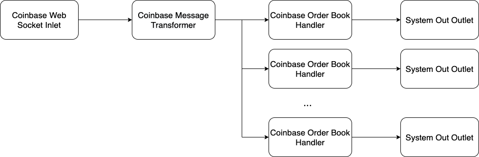

# Coinbase Pro Market order book feed
This project subscribes to Coinbase Pro Web Socket. The feed will produce messages
for the order book of the various products that Coinbase Pro hosts (BTC-USD, BTC_USDT, ETH-USDT etc.).

Each message contains updates to the Coinbase order book for a given product. This project will transform
and store the order book for a product. Upon each tick, the updated order book is printed to System Out 

## Installation
A jar can be built with the mvn command

```bash
mvn clean install
```

## Usage
This project can be run over a range of Coinbase Pro products. 

### Standard Usage
The products should be passed as a comma-separated list of each product. An 
example to run this for BTC-USD,ETH-USDT can be seen below

```bash
java -jar target/market-feed-*.jar BTC-USD,ETH-USDT
```

If no products are specified that application will default to using BTC-USD

An incorrect product passed as an argument will produce an IllegalArgumentException. 
Note: This is a static list taken from https://api.pro.coinbase.com/products, an extension of this
application can be to poll this webpage for a new product list.

### All Products
The user can run this with all products by providing the `all` keyword. The web socket will subscribe to each product
from Coinbase Pro and will keep an order book for each.

```bash
java -jar target/market-feed-*.jar all
```

Note: This may lead to rate-limiting of messages: https://docs.pro.coinbase.com/#overview

## Current Flow of Messages 
1. Coinbase Web socket inlet: Subscribes to the Coinbase Pro web socket and pushes all messages
    received from the web socket and passes it to the next stage
2. Coinbase Message Transformer: This takes in the String based JSON message from the previous
    stage a transforms it into the various Message Objects. This passes the messages to each of the order handler queues
3. Coinbase Order Book Handler: Checks if the product id of the message is relevant. If the message
    is relevant to the given order book it will update the order book for that product id. The message sent to the
    next stage is the top n orders of both the bids and asks (currently set to 10 in the config).
4. System Out Outlet: This receives the Order Book as a message from the previous stage and prints it to System.out



## Extensions
This project was built with Pipeline stages. A pipeline stage can pass a message to multiple following
stages.

### More Outlets
The current implementation will print each order book feed to System Out. However, if the user
wishes the order book feed can be outputted to multiple outlets. An example implementation of these
has been produced for a Logger Outlet and a File Outlet. With this, the user can output the
order book to both System Out, and a File with little change to the code.

## References
https://docs.pro.coinbase.com/